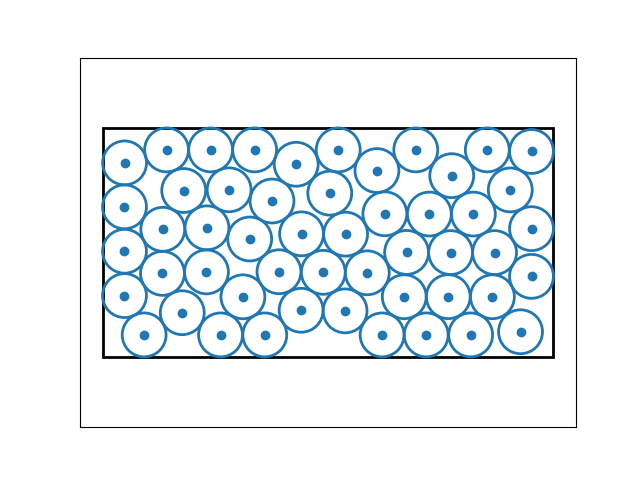

# pyspherepack [](https://travis-ci.org/cunni/pyspherepack) 

pyspherepack offers a quick and dirty algorithm for doing sphere packing with [autograd](https://github.com/HIPS/autograd).  
You specify the number of balls, and optionally the size of the box, the number of dimensions of the box, the number of optimization iterations, and so on.
This has been primarily tested against the 2D problem.
Note one major difference with this and standard sphere packing: the algorithm allows the ball centers to go up to the edge, and then post hoc pads 1 radius around the box.
This is simple and, at least in the case of the square/cube, is without loss of generality (not so in the rectangle setting). Like I said, quick and dirty.

Example use: 

```python
>>>from pyspherepack import Box
>>>import numpy as np

>>>b = Box(51,box=np.array([2.2,1.0]))
>>>b.pack()
>>>b.plot()
```

which will return some useful information (ball coordinates, radii, density, waste, etc) and a picture of the pack such as:



## Quick and Dirty! 

Please note this uses a first order gradient method, just because I was curious how well it would work.  
It is by no means optimal or even a sensible approach, but it is nice and lean.  To do a better job, see
for example:
    
* [DCCP](https://github.com/cvxgrp/dccp) or [this SO question](https://stackoverflow.com/questions/39968941/how-to-pack-spheres-in-python)
* [Here's a neat old page about circle packing](http://hydra.nat.uni-magdeburg.de/packing/csq/csq.html#overview)
* [Some branch and bound research on the topic](https://www.researchgate.net/publication/220133007_A_New_Verified_Optimization_Technique_for_the_Packing_Circles_in_a_Unit_Square_Problems?enrichId=rgreq-490d1cf3ff2b8cd8fcde9d2d6bda05db-XXX&enrichSource=Y292ZXJQYWdlOzIyMDEzMzAwNztBUzoxMDM3ODQyOTQzODc3MjVAMTQwMTc1NTUxMjk2OA%3D%3D&el=1_x_3&_esc=publicationCoverPdf)

Some current issues:
    
* deal properly with the fact that we don't enforce the box, so the radii aren't really correct
* add a shuffle_repeat method that keeps self.x_best and so on.
* make self.x clearly an unconstrained map from the box to the reals (needlessly confusing now)
* add comparison to hexagonal and square and known best
* sloppy: the way it adds the radius doesn't allow precise box aspect to be specified, only can be specified up to the edge + 2 rad, whatever that rad will be.
